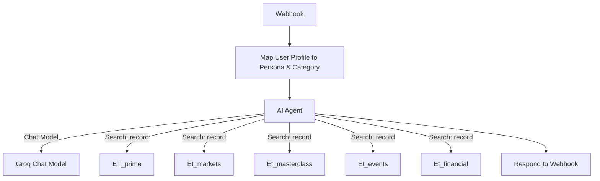

# ET Financial Concierge Agent

## Overview
ET Financial Concierge is an AI-powered agent designed to conduct structured financial conversations with users, collect their financial profiles, and guide them to the best Economic Times (ET) solutions. The agent leverages advanced LLMs, speech-to-text, and text-to-speech technologies to provide a seamless, personalized experience.

## Features
- **Conversational Flow:** Greets users, asks for their name, and then guides them through 5 structured financial questions.
- **Personalization:** Remembers user names and previous conversations for a tailored experience.
- **Profile Submission:** Submits the collected user profile to a webhook for further processing.
- **Voice Support:** Uses advanced STT (Deepgram) and TTS (Murf) for natural voice interactions.
- **Tool Integrations:** Supports emergency calls and user profile submission as tools.

## Conversation Flow
1. **Greeting & Name Request:**
   - The agent greets the user and asks for their name.
   - Acknowledges the name and explains the next steps.
2. **Financial Questions:**
   - Asks 5 specific questions about the user's financial goals, income, risk appetite, investment experience, and time horizon.
   - Presents clear options for each question and waits for user responses.
3. **Profile Submission:**
   - After collecting all answers, the agent submits the profile to a webhook.
4. **Personalized Guidance:**
   - Based on the profile, the agent guides the user to the most relevant ET solution.

## System Architecture
- **Webhook:** Receives incoming requests and responses.
- **Profile Mapping:** Maps user profile to persona and category.
- **AI Agent:** Handles conversation, memory, and tool invocation.
- **ET Data Sources:** Integrates with ET Prime, Markets, Masterclass, Events, and Financial records.

## Flowchart



## Setup Instructions
1. **Clone the Repository:**
   ```bash
   git clone <repo-url>
   cd ET-times-agent
   ```
2. **Create Virtual Environment & Install Dependencies:**
   ```bash
   python3 -m venv .venv
   source .venv/bin/activate
   pip install -r requirements.txt
   ```
3. **Configure Environment Variables:**
   - Create a `.env` file with required API keys and tokens (see `config.py`).
4. **Run the Agent:**
   ```bash
   python agent.py
   ```

## File Structure
- `agent.py` - Main agent logic and entrypoint
- `prompts.py` - Conversation instructions and prompts
- `tools.py` - Tool integrations (profile submission, emergency call)
- `config.py` - Configuration and secrets
- `requirements.txt` - Python dependencies
- `KMS/` - (Optional) Key Management Service and logs

## Customization
- **Prompts:** Edit `prompts.py` to change conversation flow or questions.
- **Tools:** Add or modify tools in `tools.py` for new integrations.
- **Logging:** Logs are stored in `KMS/logs/` for debugging and monitoring.


---

*For more details, see the code and comments in each file.*
